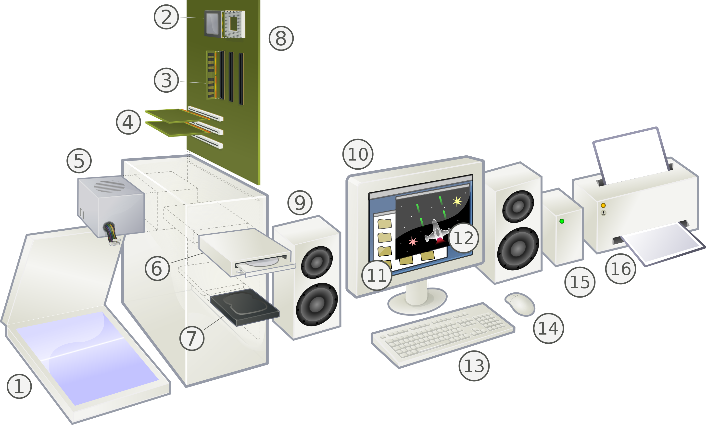
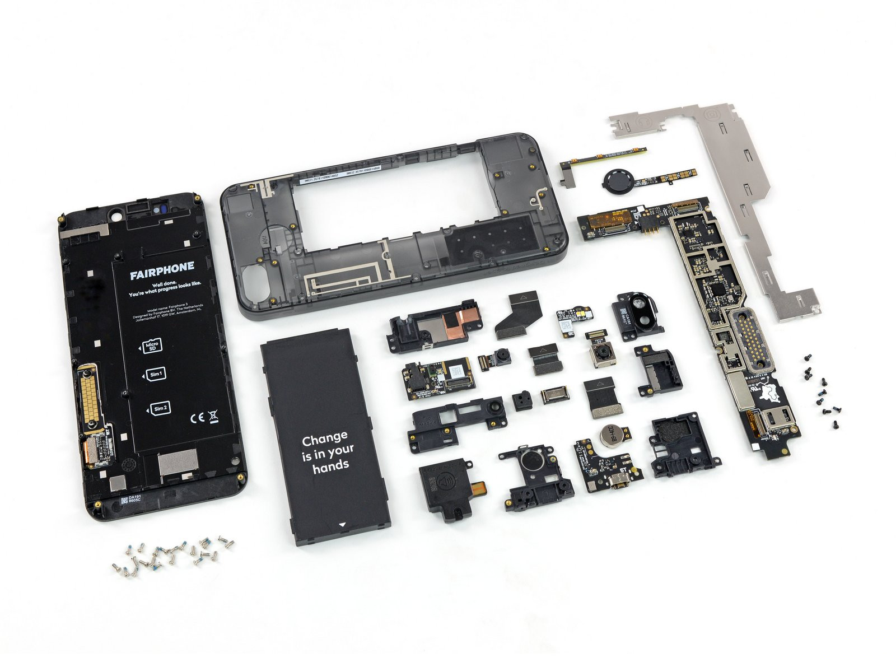

# Hardware

## Cateories

- **Computer**: Parts that make the machine itself. Those are needed to make it work.
   - **Power**: Powers the computer with electricity
   - **Process**: Process information
   - **Storage**: Store information
   - **Connect**: Connect our parts
- **Input**: Parts used to put information into the computer. Human -> Computer 
- **Output**: Parts used to move information out of computer. Computer -> Human

## Desktop PC Overview

1. Scanner
2. CPU
3. RAM
4. Expansion cards
5. Power supply
6. Optical disc drive (CD/DVD/Blu-Ray)
7. Hard drive
8. Motherboard
9. Speakers
10. Flatscreen display
11. System software
12. Application software
13. Keyboard
14. Mouse
15. External hard drive
16. Printer	

## Smartphone Overview

## Hands-on group activity

Lets take appart a:
- PC
- Notebook
- Smartphone
- Harddrive