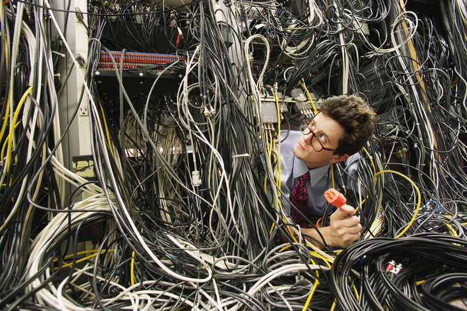
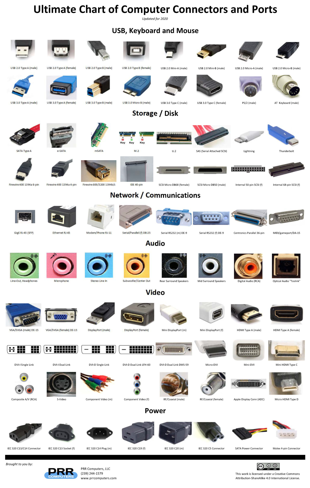
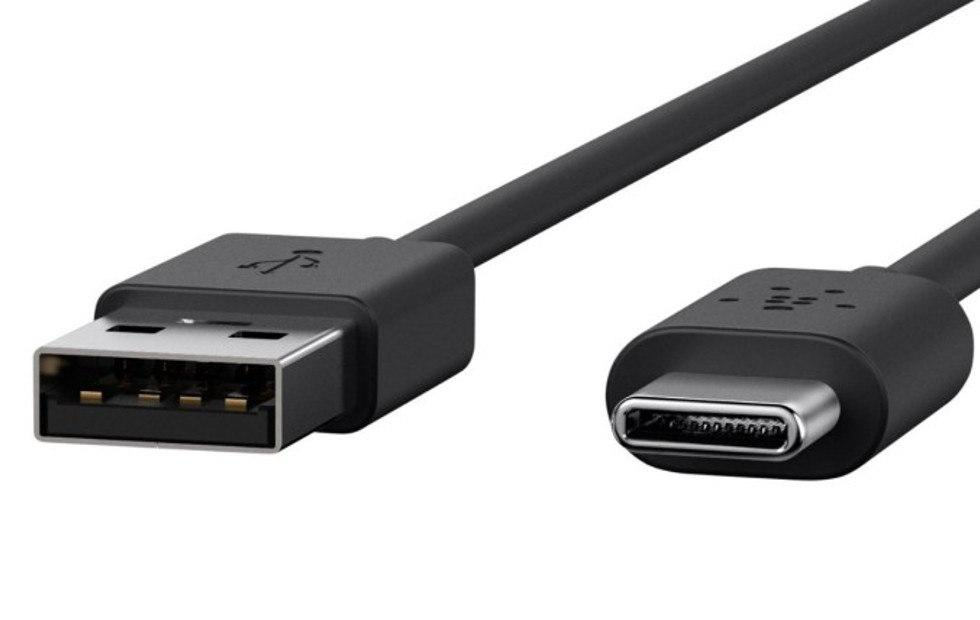
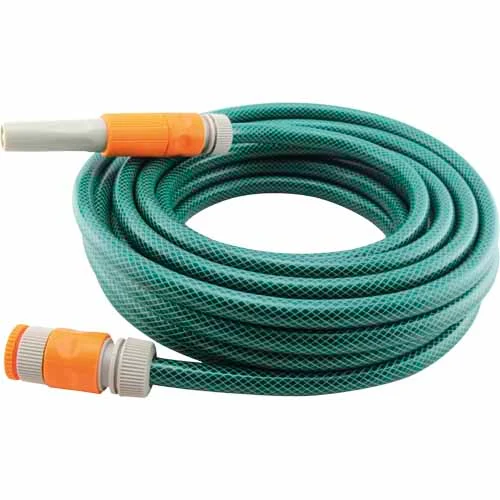
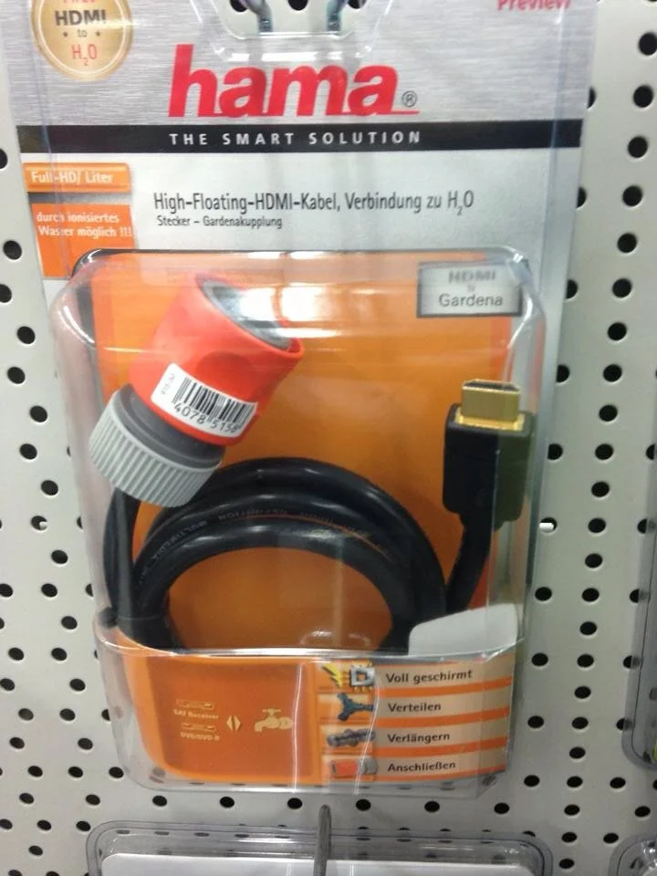

# Computer Setup

**Learning goals:**

1. Gain confidence in computer setup
2. Test setup
2. What is cable management

## What is the deal about cables and connectors?

# USB C

- industry standard

## Learn by doing 

Lets Go through one cable after the other and plug in all devices.

### Smartphone / Tablet

- Power only (careful about rotation)

### Laptop

- Power
- Video? 
- Headphones?

### PC

- Power
- Video
- Keyboard
- Mouse
- Network
- Speakers

### Adapter magic

- Smartphone <- USB-C to USB-micro <- OTG <- Mouse (dongle)
- Smartphone <- Battery <- Solar

## Recap

- Power (Laptop, PC, Macbook)
- Video cable (HDMI, Display port)
- USB (A, mini, micro, C)
	- Keyboard
	- Mouse
- Audio jack (3.5mm, 6.35mm)
- Network cable
